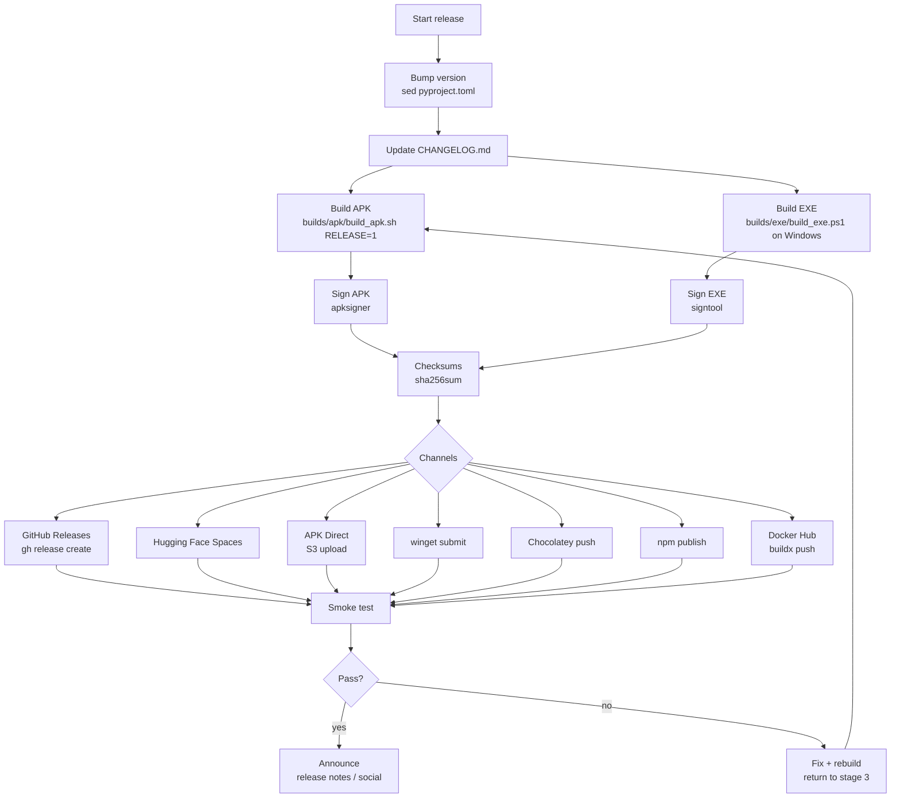

# Sovereign — Release Pipeline

End-to-end workflow for shipping a new SOVEREIGN release across all
distribution channels. Orchestrated by `distribution/release_pipeline.sh`.

## Stage overview

1. **Version bump** — `release_pipeline.sh` stamps the new version into
   `pyproject.toml` (`sed` on `^version = …`) and updates the Android
   `versionName`/`versionCode` where required.
2. **Changelog** — add entries under `CHANGELOG.md` (Keep a Changelog
   format), referencing the PRs included in this release.
3. **Build** — produce the APK (`builds/apk/build_apk.sh` with
   `RELEASE=1`) and the EXE (`builds/exe/build_exe.sh` on Windows, Linux
   fallback binary for Unix hosts).
4. **Sign** — `apksigner` for the APK, `signtool` for the EXE, plus
   `sha256sums` for every artifact (see `packaging/README.md`).
5. **Publish** — push to the channels listed in `release_channels.yaml`
   (GitHub Releases, HF Spaces, APK direct, winget, Chocolatey, npm,
   Docker Hub).
6. **Smoke test** — verify `/health`, `sovereign --help`, APK install and
   EXE launch on a clean machine.
7. **Announce** — GitHub release notes, Discord/Telegram, X post, changelog
   link.

## Workflow diagram



## Commands

```bash
# Full release to all channels (Linux/CI host)
VERSION=0.2.0 \
CHANNELS=github-releases,apk-direct,docker-hub,npm \
  distribution/release_pipeline.sh

# Release to a single channel
VERSION=0.2.0 CHANNELS=github-releases \
  distribution/release_pipeline.sh

# Build only (no publish) — invoke build scripts directly
RELEASE=1 builds/apk/build_apk.sh
builds/exe/build_exe.sh          # prints Windows instructions, builds Linux bin
```

## Manual steps not yet automated

- **Windows EXE signing**: `signtool` runs on Windows; the pipeline echoes
  the command — run it on the Windows build host before publishing.
- **macOS notarization**: manual (see `packaging/README.md` §6).
- **winget / Chocolatey**: require external PR review; submit early.

## Rollback

- Docker: re-tag the previous image (`sovereignai/orchestrator:0.1.0`).
- APK/EXE: keep prior artifacts and checksums in the release + S3 bucket.
- npm: `npm unpublish @sovereign-ai/orchestrator@<bad>` within 72 h.
- GitHub: edit the release to un-list assets.
