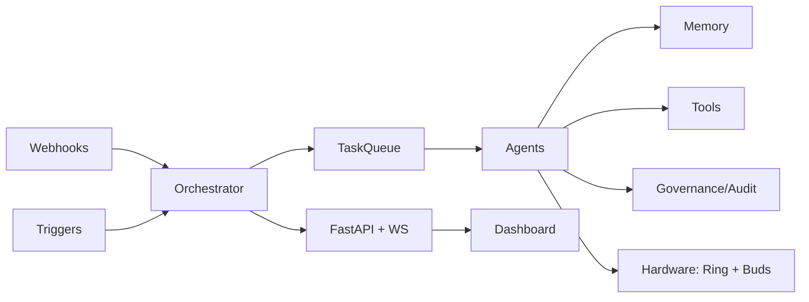

# SOVEREIGN — Architecture

## System context

SOVEREIGN is a self-hosted, privacy-preserving AI orchestration layer
("sovereign" = no mandatory external API calls; everything can run locally
or in your own VPC). It coordinates agents, tasks, memory, tools, policies,
models, and connected hardware (BCI ring + earbuds) — while connecting the
entire OGU project constellation.

## Layered view

```
┌─────────────────────────────────────────────────────────────────────┐
│  API layer (FastAPI REST + WebSocket)  /api/v1/*  /ws/events        │
├─────────────────────────────────────────────────────────────────────┤
│  Orchestrator  (core loop, scheduler, state machine, task queue,    │
│                 agent factory, workflow engine)                     │
├─────────────────────────────────────────────────────────────────────┤
│  Agents (chat/reasoner/coder/tool/coordinator/memory/supervisor)    │
├─────────────────────────────────────────────────────────────────────┤
│  Memory · Tools · Knowledge · Governance · Security · Communication │
├─────────────────────────────────────────────────────────────────────┤
│  Models (sovereign LLM · DeepSeek-V4-Flash-0731 · Fish S2-Pro)      │
│  Hardware (ring + buds) · Buckets · Distribution · Integrations     │
└─────────────────────────────────────────────────────────────────────┘
```

## Core flows

1. **Task lifecycle**: `submit_task → queue (priority heap, optional SQLite
   durability) → _process_tasks → _execute_task → agent → result` with
   retry-on-failure (max_retries) and full audit events.
2. **Agent lifecycle**: `BaseAgent` interface with states
   idle → running → completed|failed → shutdown; supervisor monitors and
   restarts.
3. **Memory**: working (TTL) / episodic (SQLite) / semantic (triples) /
   procedural (recipes) / vector (memory or chroma) behind `MemoryManager`;
   RAG retrieval with sovereign hash-placeholder embeddings by default.
4. **Tools**: registry + executor + authorization; every tool invocation is
   audited, metered, and policy-gated (RBAC tool permissions).
5. **Events**: in-process EventBus; WebSocket bridge (`/ws/events`);
   webhook receivers for GitHub / HuggingFace / generic sources.
6. **Integrations**: `integrations/connector.py` verifies all 18 connected
   OGU projects; tasks/routines consume them (lineage-sync, scout, ...).

## Key decisions

| Decision | Rationale |
|---|---|
| stdlib-first core | Orchestrator imports/runs with zero third-party deps |
| Optional heavy deps | fastapi/httpx/chromadb/transformers degrade gracefully |
| Hash-placeholder embeddings | Sovereign default: no network needed for RAG |
| SQLite durability | Blueprint-compatible state without Redis dependency |
| Tamper-evident audit | Hash-chained JSONL (prev_hash per record) |

## Data flow diagram



See `docs/developer_guide.md` for module-level details.
